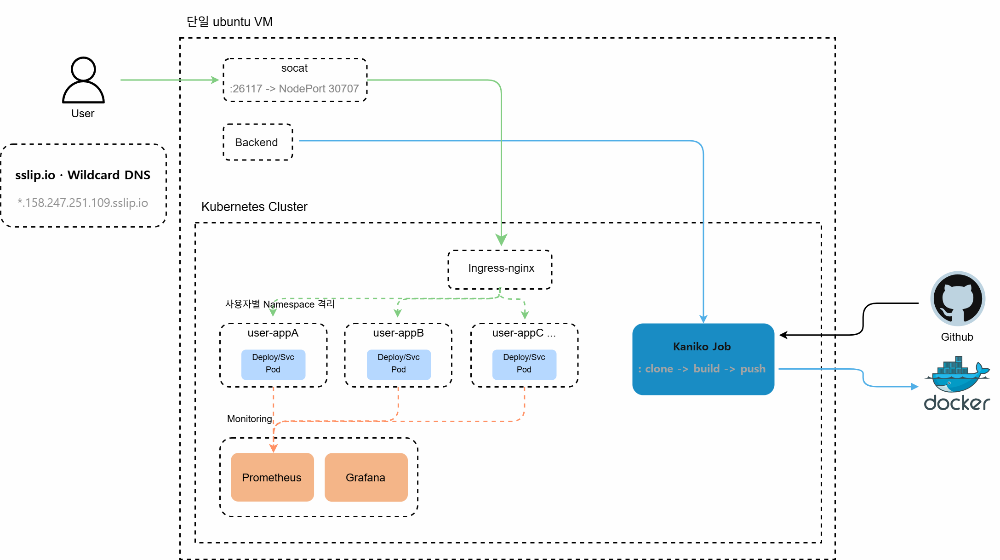
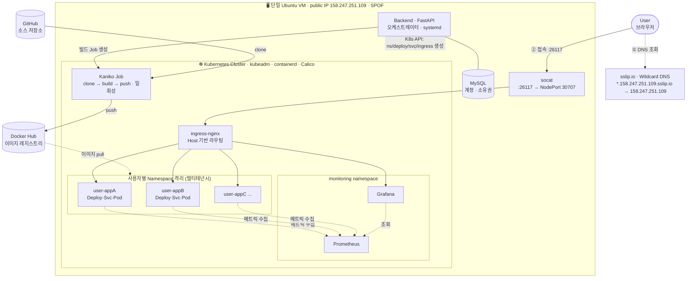

# NimbusEngine — Infra

매니지드 쿠버네티스(EKS/GKE) 없이, **단일 Ubuntu VM 위에 `kubeadm`으로 직접 구성한 self-hosted PaaS**의 인프라 레포입니다.
사용자가 GitHub 저장소 URL만 입력하면 → 이미지 빌드 → 쿠버네티스에 격리 배포 → 고유 URL로 접속까지 자동화됩니다.

> 이 레포는 **인프라/배포/운영** 산출물(매니페스트, 클러스터 구성, 트러블슈팅)을 담습니다.
> 애플리케이션 코드는 [backend](https://github.com/NimbusEngine/backend) · [frontend](https://github.com/NimbusEngine/frontend) 참고.

---

## 아키텍처



<details>
<summary>텍스트(mermaid) 버전 펼치기</summary>



</details>

**한눈에 보는 흐름**
1. **접속**: `*.sslip.io`가 단일 public IP로 해석 → socat → ingress-nginx가 **Host 헤더로 서비스 분기**
2. **배포**: Backend가 GitHub repo 감지 → **Kaniko(데몬리스 빌드)**로 이미지 생성·push → K8s API로 **Namespace 격리 배포**
3. **모니터링**: Prometheus가 각 Pod 메트릭 수집, Grafana로 시각화

---

## 기술 스택

| 영역 | 사용 기술 |
|---|---|
| 오케스트레이션 | Kubernetes (`kubeadm`, 단일 노드) |
| 컨테이너 런타임 | containerd |
| CNI | Calico |
| 외부 노출 | ingress-nginx + sslip.io (wildcard DNS) |
| 이미지 빌드 | Kaniko (데몬리스) → Docker Hub |
| 모니터링 | Prometheus + Grafana (kube-prometheus-stack) |
| 오케스트레이터 | FastAPI (systemd) + MySQL |

---

## 핵심 설계 포인트

- **멀티테넌시** — 배포마다 `user-<name>` Namespace를 생성해 사용자 간 리소스를 격리
- **데몬리스 빌드** — 런타임이 containerd라 Docker 데몬이 없음 → 이미지 빌드에 **Kaniko** 채택 (데몬/root 불필요)
- **단일 IP 다중 서비스** — 도메인·DNS 서버 구매 없이 **sslip.io 와일드카드**로 호스트명을 무한 생성, ingress-nginx가 Host 기반 분기
- **비동기 빌드** — 오래 걸리는 빌드를 K8s Job으로 분리하고, 프론트가 상태를 폴링 (nginx 타임아웃 회피)

---

## 저장소 구조

```
.
├── cluster/          # 클러스터 부트스트랩 (kubeadm, CNI) 기록
├── manifests/        # 실제 적용한 매니페스트
│   └── reference/    # Backend가 코드로 생성하는 리소스의 참고 예시
├── monitoring/       # Prometheus/Grafana (helm values)
├── docs/             # 트러블슈팅 등
├── scripts/          # 클러스터 상태 덤프 스크립트
└── assets/           # 아키텍처 다이어그램 이미지
```

---

## 한계 & 개선 방향

현재 구성의 한계를 인지하고 있으며, 프로덕션이라면 다음을 개선하겠습니다.

| 한계 | 개선 방향 |
|---|---|
| **단일 노드 = SPOF** (VM 장애 시 전체 중단) | 멀티 노드 클러스터 또는 매니지드 K8s |
| Backend가 로컬 상태(MySQL)에 결합 → **수평 확장 불가** | DB 외부화(RDS 등), Backend stateless화 |
| DB 비밀번호가 코드에 하드코딩 | **환경변수 / K8s Secret**으로 분리 |
| Namespace만 격리, **네트워크 미격리** | NetworkPolicy로 테넌트 간 통신 차단 |
| 사용자 Pod에 리소스 제한 없음 | ResourceQuota / LimitRange |
